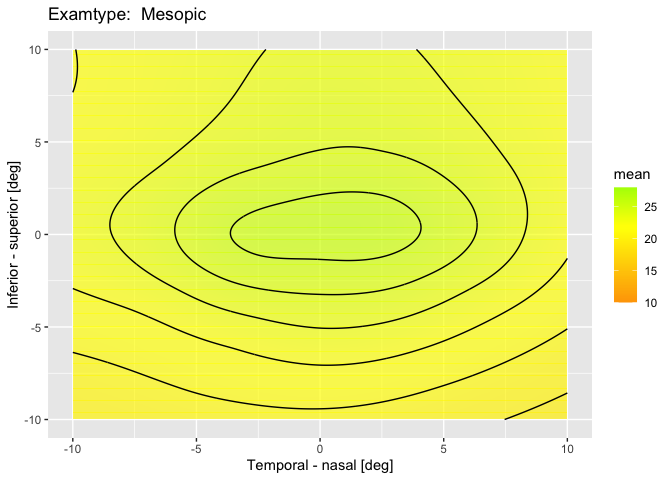
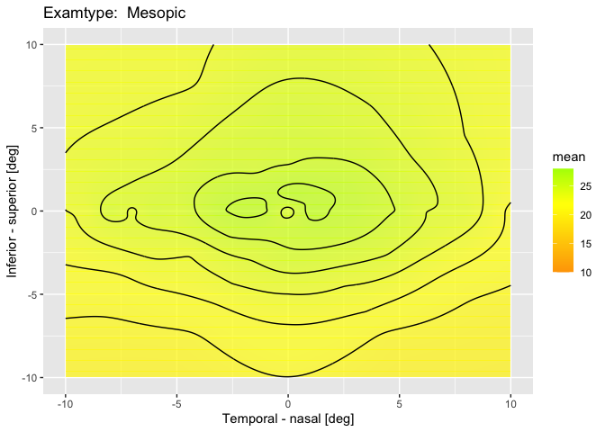

<!-- README.md is generated from README.Rmd. Please edit that file -->

# NormalRetina

<!-- badges: start -->

[](https://github.com/UofUEpiBio/egpkg/actions/workflows/R-CMD-check.yaml)
<!-- badges: end -->

The goal of NormalRetina is to predict normative retina sensitivity,
providing tools for data processing, modeling, prediction and
visualization. It is particularly useful for age-adjusted normative data
for retinal sensitivity.

## Installation

You can install the development version of NormalRetina from
[GitHub](https://github.com/LydiaYW/NormalRetina) with:

``` r
# install.packages("devtools")
devtools::install_github("LydiaYW/NormalRetina")
```

## Features

- **Data Preprocessing** *SensForFit*: A function to clean and prepare
  retinal sensitivity data for analysis, with variables: participant
  age, eye, eccentricity and angular distance from the fovea, and
  spatial coordinates (x,y). Also patient-wise k-fold split for model
  training.
- **Virtual Datasets**: Includes two example datasets representing
  normative retinal sensitivity for reference patients. First is
  *ref77*, a virtrual patient of age 77, for spatial interpolation and
  visualization. The other is *refMes*, a virtrual population with 100
  healthy participants’ Mesopic sensitivity results.
- **Prediction Models**:
  - Support for **Linear Mixed Models (LMM)**, **Bayesian Quantile
    Regression (BQR)**, and **Random Forest (RF)**.
  - Functions to compare model performance and provide age-adjusted
    prediction based on the selected best method based on a population.
- **Spatial Interpolation**: A method for interpolating retinal
  sensitivity for one patient.
- **Visualization**:
  - Functions for creating hill-of-vision map of predicted retina
    sensitivity for different exam types.

------------------------------------------------------------------------

## Example

This is a basic example which shows you how to solve a common problem:

    #> Estimating learning rate. Each dot corresponds to a loss evaluation. 
    #> qu = 0.5.........done 
    #> Estimating learning rate. Each dot corresponds to a loss evaluation. 
    #> qu = 0.025...............done 
    #> Estimating learning rate. Each dot corresponds to a loss evaluation. 
    #> qu = 0.975.................done 
    #> Estimating learning rate. Each dot corresponds to a loss evaluation. 
    #> qu = 0.5............done 
    #> Estimating learning rate. Each dot corresponds to a loss evaluation. 
    #> qu = 0.025................done 
    #> Estimating learning rate. Each dot corresponds to a loss evaluation. 
    #> qu = 0.975.............done 
    #> Estimating learning rate. Each dot corresponds to a loss evaluation. 
    #> qu = 0.5............done 
    #> Estimating learning rate. Each dot corresponds to a loss evaluation. 
    #> qu = 0.025.........done 
    #> Estimating learning rate. Each dot corresponds to a loss evaluation. 
    #> qu = 0.975..........done 
    #> Estimating learning rate. Each dot corresponds to a loss evaluation. 
    #> qu = 0.5............done 
    #> Estimating learning rate. Each dot corresponds to a loss evaluation. 
    #> qu = 0.025.........done 
    #> Estimating learning rate. Each dot corresponds to a loss evaluation. 
    #> qu = 0.975.................done 
    #> Estimating learning rate. Each dot corresponds to a loss evaluation. 
    #> qu = 0.5..........done 
    #> Estimating learning rate. Each dot corresponds to a loss evaluation. 
    #> qu = 0.025...........done 
    #> Estimating learning rate. Each dot corresponds to a loss evaluation. 
    #> qu = 0.975..............done 
    #> Estimating learning rate. Each dot corresponds to a loss evaluation. 
    #> qu = 0.5.................done 
    #> Estimating learning rate. Each dot corresponds to a loss evaluation. 
    #> qu = 0.025.............done 
    #> Estimating learning rate. Each dot corresponds to a loss evaluation. 
    #> qu = 0.975............done 
    #> Estimating learning rate. Each dot corresponds to a loss evaluation. 
    #> qu = 0.5............done 
    #> Estimating learning rate. Each dot corresponds to a loss evaluation. 
    #> qu = 0.025.................done 
    #> Estimating learning rate. Each dot corresponds to a loss evaluation. 
    #> qu = 0.975..............done 
    #> Estimating learning rate. Each dot corresponds to a loss evaluation. 
    #> qu = 0.5..........done 
    #> Estimating learning rate. Each dot corresponds to a loss evaluation. 
    #> qu = 0.025............done 
    #> Estimating learning rate. Each dot corresponds to a loss evaluation. 
    #> qu = 0.975.............done 
    #> Estimating learning rate. Each dot corresponds to a loss evaluation. 
    #> qu = 0.5.........done 
    #> Estimating learning rate. Each dot corresponds to a loss evaluation. 
    #> qu = 0.025...........done 
    #> Estimating learning rate. Each dot corresponds to a loss evaluation. 
    #> qu = 0.975...........done 
    #> Estimating learning rate. Each dot corresponds to a loss evaluation. 
    #> qu = 0.5...........done 
    #> Estimating learning rate. Each dot corresponds to a loss evaluation. 
    #> qu = 0.025..........done 
    #> Estimating learning rate. Each dot corresponds to a loss evaluation. 
    #> qu = 0.975............done
    #>             Model MAE                MACE                
    #> lmm_results "LMM" "1.41338551298175" "0.0252792052478238"
    #> bqr_results "BQR" "1.70689610358974" "0.0181690171638242"
    #> rf_results  "RF"  "1.53732237195878" "0.0297107777235023"
    #> Estimating learning rate. Each dot corresponds to a loss evaluation. 
    #> qu = 0.5.........done


